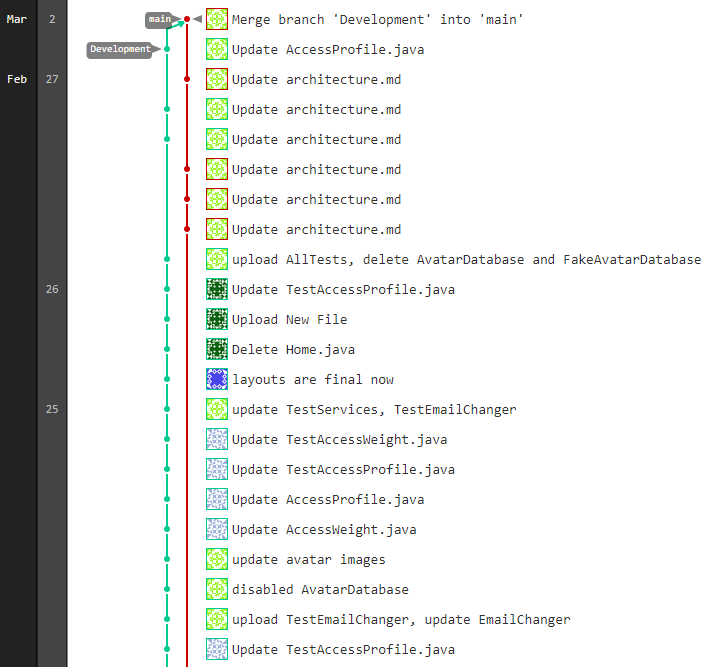

# Iteration 1 Worksheet
## Adding a Feature

Feature: User Profile #2  
First, we created user stories for the feature:
- #11
- #12
- #13

Then we divided the work into the user interface, business and database layers of the app. We had one person work on the user interface, one person work on the database, and two people work on the logic.  
Once we were finished working individually, we had a meeting to discuss connecting the app layers. Then, when everything was connected we made unit tests for the logic code.  
- [AllTests.java](app/src/androidTest/java/com/example/personalfitnesstrainer/AllTests.java) - all tests are related to the User Profile feature.

Once all of our tests passed, we merged our work into the main branch. d9ed2bcc46e4a1fd1d64a757b1d1d5aef180dd65

## Exceptional Code

[fragments/Profile.java](app/src/main/java/com/example/personalfitnesstrainer/fragments/Profile.java#L55)

The method being called inside the try-catch block at line 55 requires parsing a String input into a double. If the input is not a valid number, an exception will be thrown which is caught by the try-catch block. If an exception is caught, a Toast message will be displayed in the UI which tells the user about the incorrect input.  

## Branching
Our branching strategy is described [here](README.md#L27).
Here is a screenshot of Development being merged into main after the UserProfile feature was finished:

## SOLID
[This is the issue we created](https://code.cs.umanitoba.ca/winter-2022-a01/group-15/better-than-aurora-registration-system-a01/-/issues/37) for Group 15's project.

## Agile Planning
We initially planned to implement the User Profile, Activity Planner and Fitness Record features and their user stories for Iteration 1, however as we worked on the User Profile we realized we would not have time to implement other features.  
We ended up pushing the following issues to Iteration 2:
- Features: #3, #4
- User Stories: #14, #15, #25, #26

Another change we made was removing the planned Avatar database. The avatar for each profile is stored in the corresponding Profile object, and the avatar database was planned to contain all of the file names for the pre-made avatars a user can select for their profile. We decided we did not need a database for this, since it was easier to directly get the choices from app/res/drawable.
